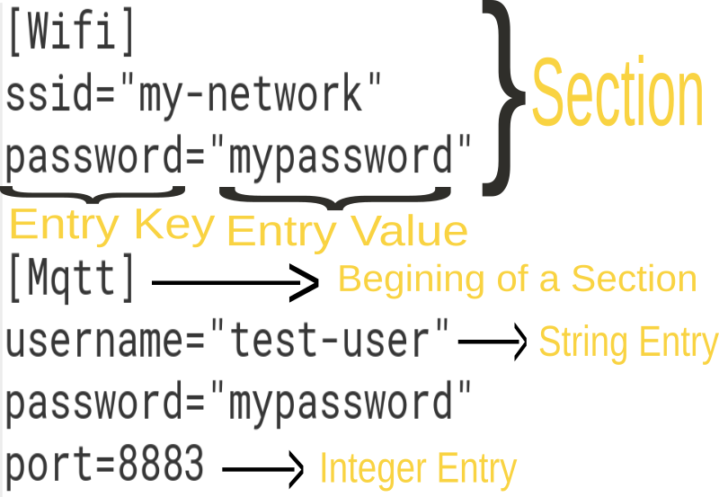

# A Configuration File Manager for Micropython
## Introduction

ConfigManager is a simple configuration file manager that can help you to read and write configuration files on your Micropython Devices. You can use this, for example, to save your wifi details or mqtt details on your device and access them easily. For now tested only on **ESP32** , but should probably work fine on other devices too.

> You can even use regular python installation in your pc to test this module.

## Features
- Configuration files can be read and written.
- Configurations can be accessed in the form of nested list.
- Supports entry values with 2 datatypes - string and integer.
- While updating a config_file, a new file is created and then renamed to the original file's name. So even if updating the configuration file is not successful, the orginal file is preserved.
- Supports Comments in the configuration file.

## License
[](https://opensource.org/licenses/MIT)

This is an open-source project and welcomes contributions. Note that this project is licensed under the MIT license, and all contributions should follow this license. For more info look at [LICENSE File](LICENSE) .

## Before you start

- Please do note that you need to create a directory named **config** on your micropython device [or pc] and save all your configuration files there so that configmgr can access it. This is done to keep all the files in one place. 
- I use **.conf** as the extension for the configuration files. You can use other ones as well.
- Parts of Config File is given below for your reference:



## Syntax of the Configuration file
- Comments start with a ' Hashtag **#** ' . Comments can either be inline or a block.
```
# A Block Comment
[some-section] # Inline Comment
some_entry="Some-Value" # Another Inline Comment
```
- Every section will start with the section name enclosed within a ' square bracket **[ ]** ' .
```
[some-section]
```
- A Entry must have a key and value. The key and value are seperated by ' Equal to sign **=** '. The Entry Values can be Strings or Integers. String values are enclosed within ' double quotes **" "**  ' where as Integer values are not enclosed within quotes.

```
some_string="some_text" # A Integer Entry
some_integer=1234 # A String Entry
```

## Getting Started

> In this section you will learn how to read and update a configuration file.

 Create a sample configuration file **sample.conf** as follows -

```
# Wifi Configuration
[Wifi]
ssid="my-network" 
password="mypassword"

# Mqtt Configuration
[Mqtt]
username="test-user"
password="mypassword"
port=1883 # Use 8883 for SSL
```

Then in the repl enter :

```
>>> from configmgr import *
>>> myconfigfile = ConfigFile('sample.conf')
>>> myconfigfile.read()
>>> myconfig = myconfigfile.config
>>> print(myconfig)
```

OUTPUT -

```
{'Mqtt': {'username': 'test-user', 'password': 'mypassword', 'port': 1883}, 'Wifi': {'ssid': 'my-network', 'password': 'mypassword'}}
```

As you can see from the output, the **myconfig** variable is a nested dictionary. You can easily use it to get any entry from any section or a specific section also.

> To get a specific section use **myconfig['section_name']**

> To get a specific entry from a section use **myconfi['section_
name']['entry_key']**

```

>>> myconfig['Mqtt'] # To get a specific section
{'username': 'test-user', 'password': 'mypassword', 'port': 1883}

>>> myconfig['Wifi']['password'] # To get a specific entry
'mypassword'

```

Now, to change any value in your configuration file you just need to change the value of entry and use **write** method and pass the configuration as an argument.

```
>>> myconfig['Mqtt']['port'] = 8883 # Change the port of MQTT
>>> myconfigfile.write(myconfig)
```

Now the contents of the sample.conf will be -

```
[Wifi]
ssid="my-network"
password="mypassword"

[Mqtt]
username="test-user"
password="mypassword"
port=8883
```

Alternatively you can even change the config file in the following manner.

```
>>> myconfigfile.set_entry('Mqtt', 'port', '8883')
>>> myconfigfile.write()
```
This will also produce the same outuput as above.

## Methods of ConfigFile Class

- ### __init\__(filename)
    - **filename** - Must be the filename along with extension. The prefix 'config/' is automatically added.

- ### read()
    Used to read the config file.

- ### reload()
    Same function as read(). Used during runtime to reread the config file.

- ### write(config=None, filename=None)
    Used to write to a config file. 
    - **config** - the nested dictionary that contains the  configurations. Default - Configuration of the file read.
    - **filename** - the filename to write. Default - Configuration filename passed during init.

- ### set_section(section)
    Used to create an empty section.
    - **section** - Name of the section

- ### set_entry(section, key, value)
    Used to create a entry in a section. If the section does not exist then it is created.
    - **section** - Name of the section
    - **key** - The Key of the Entry
    - **value** - The Value of the Entry

- ### remove_section(section)
    Used to remove a section.
    - **section** - Name of the section

- ### remove_entry(section, key, value)
    Used to remove a particular entry in the section.
    - **section** - Name of the section
    - **key** - The Key of the Entry
    - **value** - The Value of the Entry

## Important Attributes of ConfigFile Class
- ### config
    Contains the configuration nested dictionary. It is an empty dictionary until read() is used.

- ### sections
    Contains a list of sections in the configuration file.

- ### filename
    Contains the filename of the configuration file.

## Questions, Feedback or Suggestions
If you have any questions, feedback or suggestion, feel free to contact me through email.
Email : uthayamurthy2006@gmail.com

## Limitations
- Comments are not preserved when updating the configuration file.
- Single quotes for string entry values are not supported.
